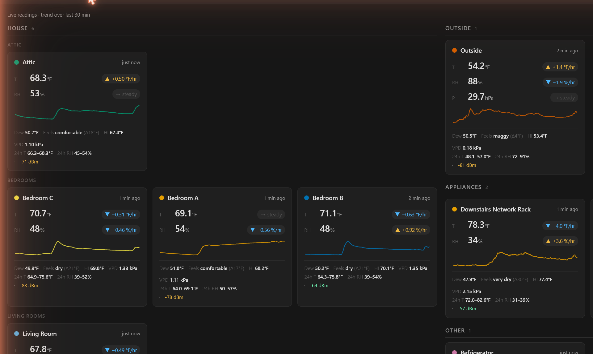
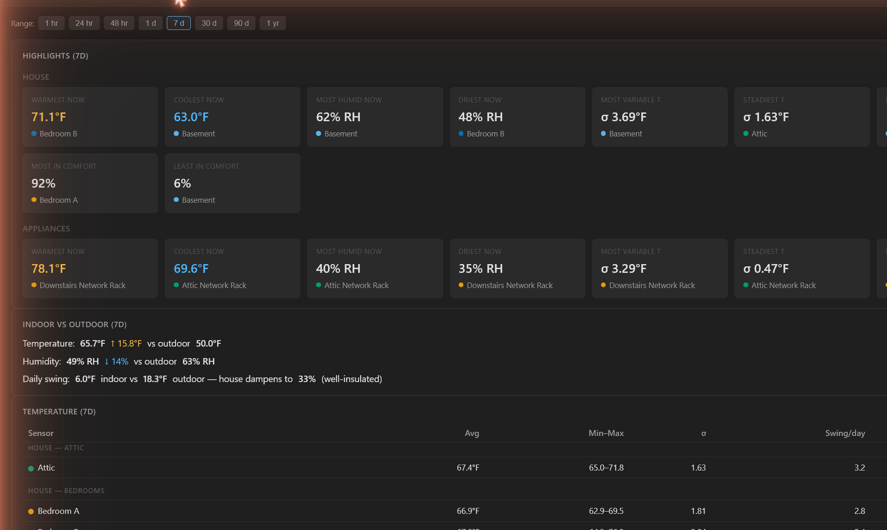
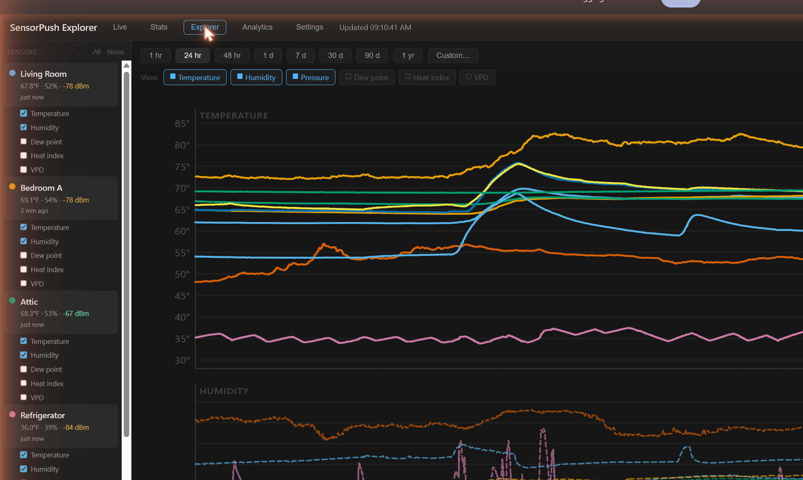
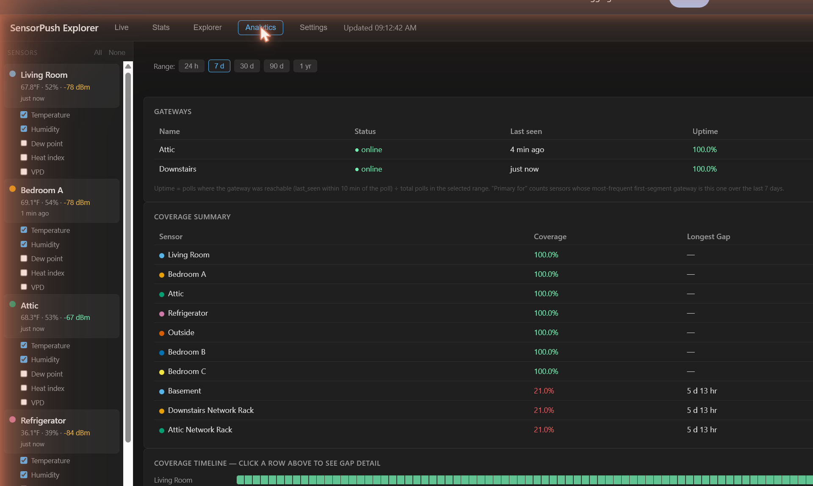
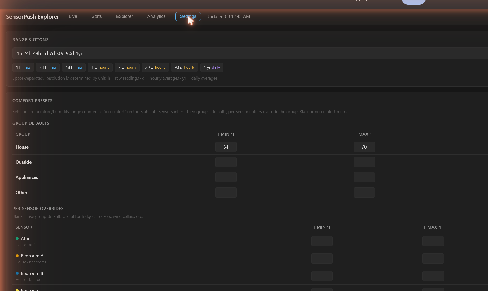

# sensorpush-recorder

Self-hosted recorder for [SensorPush](https://www.sensorpush.com/) wireless temperature/humidity/pressure sensors.

Polls the SensorPush cloud every 5 minutes, stores all readings locally in SQLite, exposes a REST API, and ships with a self-contained Explorer UI for charting, gap analysis, and data QA.

## Features

- **Continuous polling** — every 5 min, with 24h lookback to absorb late-published cloud data.
- **30-day initial backfill** — first run pulls a month of history per sensor.
- **Full schema** — temperature, humidity, barometric pressure, dewpoint, VPD, battery, RSSI, plus the gateway each sample arrived through.
- **Gateway tracking** — polls `/devices/gateways` alongside sensors; appends a `gateway_status` row per poll so you can answer "was the gateway online during this gap window?" after the fact.
- **Gap analysis** — detects missing windows (interior, leading, and trailing), sparse hours, and per-gap gateway-online status. A dead sensor reports as one big trailing gap, not as 100% coverage.
- **Targeted backfill** — "Fix all gaps" button re-fetches only the windows the local DB shows as missing, instead of broadly re-pulling the whole range.
- **Data QA** — exclude individual readings or whole hourly buckets from charts and aggregates; hourly aggregates auto-recompute on exclusion.
- **Five-tab UI** — Live (real-time cards with feels-like, alert thresholds, anomaly flags, recent events), Stats (records, hour/minute-of-day heatmaps, sensor-pair correlation, mold/condensation risk, HVAC duty-cycle, HVAC zone analysis, alert breach history, comfort presets, year-over-year overlay, indoor-vs-outdoor weather delta, battery forecast), Explorer (multi-sensor chart with toggleable series, zoom, exclusion edit mode, event markers, outdoor weather overlay), Analytics (coverage timeline, gap detail, gateway panel with uptime), Settings (comfort presets, HVAC thermostat flags, bearer token, notification sinks + condition toggles, backups list + restore).
- **Outdoor weather correlation** — pulls hourly conditions from [Open-Meteo](https://open-meteo.com/) (no API key) for a configured `lat,lon` and overlays them on charts plus an indoor-vs-outdoor delta panel.
- **MQTT bridge** — optional publish-only Home Assistant integration. Emits HA discovery messages hourly and retained per-sensor state every poll when `MQTT_URL` is set; no-op otherwise.
- **Outbound notifications** — webhook + ntfy.sh sinks with per-(condition, target) state machine. Fires on transition→active and transition→recovered; conditions include threshold breach, hour-of-day anomaly, sensor-offline, gateway-offline.
- **Prometheus `/metrics`** — text-exposition endpoint (LAN-scrape pattern; bypasses bearer auth) covering temperature/humidity/dewpoint/VPD/battery/RSSI, gateway last-seen, and poll-health.
- **PWA** — installable, offline-shell cached via service worker.
- **Cross-origin friendly** — explicit CORS allowlist so the same recorder can serve a primary dashboard, a kiosk, and local dev.
- **Self-healing** — daily auto gap-fill at 03:00 plus daily SQLite snapshot (`VACUUM INTO`) to `/data/backups/` (7-day retention, with restore-from-snapshot UI).
- **Battery monitoring** — UI badges sensors with low (≤2.7V) or critical (≤2.5V) battery voltage, plus projected days-until-replacement via `/battery`.
- **CSV export** — `GET /:id/history.csv?range=7d` for spreadsheet analysis.

## Tour

Sensor names in the screenshots below are anonymized (`Bedroom A/B/C`); the UI shows your real SensorPush labels.

### Live

Real-time cards grouped by zone (House / Outside / Appliances / Other), with trend arrows, feels-like, dewpoint spread, and battery RSSI badges. Anomalous readings for the current hour-of-day get flagged automatically.



### Stats

Aggregated view over the selected range: per-zone highlights (warmest/coolest/most-humid/driest/most-variable/in-comfort), indoor-vs-outdoor swing and weather delta, per-sensor temperature + humidity tables, hour-of-day + minute-of-hour heatmaps, sensor-pair correlation matrix, mold/condensation risk, HVAC duty-cycle + zone analysis, alert breach history, comfort presets, a battery-replacement forecast, and an opt-in year-over-year overlay when ≥1 year of data is present.



### Explorer

Multi-sensor chart with togglable series (temperature, humidity, pressure, dewpoint, heat index, VPD) and zoom, an outdoor-weather overlay (when `weather.{lat,lon}` is configured), user-annotated event markers, plus an edit mode for excluding bad readings or whole hourly buckets from aggregates.



### Analytics

Per-gateway status with uptime % and primary-sensor count, plus a coverage summary and timeline showing each sensor's missing windows. Each gap is annotated with whether the gateway was online during it (so a sensor outage can be told apart from a gateway outage).



### Settings

Range-button configuration, per-zone and per-sensor "comfort" presets used by the Stats tab, HVAC thermostat-reference sensor flags, bearer-token controls under Security, notification sinks (webhook + ntfy) with per-condition enable toggles, and a backups panel listing daily SQLite snapshots with one-click restore.



## Quick start

```bash
git clone <this-repo>
cd sensorpush-recorder
cp config.js.template config.local.js
# edit config.local.js with your sensorpush.com email + password
docker compose up -d
```

- API + Explorer UI: <http://localhost:3003/>
- Health: <http://localhost:3003/health>

The first poll backfills 30 days of history; subsequent polls run every 5 minutes.

## Configuration

| Source | Purpose |
|---|---|
| `config.local.js` (mounted to `/config/config.local.js`) | SensorPush credentials — file mode |
| `SENSORPUSH_EMAIL` + `SENSORPUSH_PASSWORD` env vars | SensorPush credentials — env mode (preferred for managed deploys; wins over the file when both set) |
| `CORS_ORIGINS` env var | Comma-separated allowlist of origins permitted cross-origin |
| `RECORDER_TOKEN` env var | Optional shared bearer (alternative to UI-managed file token) |
| `DB_PATH` env var (default `/data/sensorpush.db`) | SQLite location |
| `PORT` env var (default `3003`) | HTTP port |
| `HEALTH_MAX_POLL_AGE_SECS` env var (default `1800`) | `/health` answers 503 when this process's last successful poll is older than this; `0` disables |
| `METRICS_MAX_AGE_MS` env var (default `15000`) | Max age of the cached `/metrics` body before a scrape triggers a re-render |

CORS: only origins listed in `CORS_ORIGINS` get an `Access-Control-Allow-Origin` header. The header is never `*` — each origin is echoed exactly when it matches.

### SensorPush credentials — file vs env

The recorder needs your `sensorpush.com` login to call SensorPush's cloud API. Two ways to provide it:

**File mode** (LAN / single-host self-host):

```js
// /config/config.local.js
window.DASHBOARD_CONFIG = {
  sensorpush: { email: 'you@example.com', password: 'yourpassword' }
};
```

Mount that file at `/config/config.local.js`. Same shape the original storie-dashboard used; copy/paste compatible.

**Env-var mode** (managed Fly / Kubernetes / any container env that injects secrets):

```bash
SENSORPUSH_EMAIL=you@example.com
SENSORPUSH_PASSWORD=yourpassword
```

Env vars take precedence over the file when both are set, so a managed deploy can override stale mounted state without touching the file.

### Auth (bearer token)

When the recorder is reachable from the public internet (e.g. via Cloudflare Tunnel), enable bearer-token auth so origin-allowlist isn't the only line of defense:

**Easy mode — generate from the UI:**

1. Open `http://localhost:3003/` (or your public URL) in a browser.
2. Go to **Settings → Security**.
3. Click **Generate token**.
4. Copy the token shown once (it's stored at `/data/recorder-token` server-side and never displayed again).
5. Paste it into your client (e.g. the rosestorie dashboard's SensorPush settings).

The token resolution order is `RECORDER_TOKEN` env var → `/data/recorder-token` file → no auth. Once a token is set, every route except `/health`, `/metrics`, the UI page and its icons, manifest and service worker needs one of:

- **`Authorization: Bearer <token>`**: for programmatic callers (the rosestorie dashboard, scripts, etc.).
- **A browser session.** The Explorer UI shows a sign-in form; enter the token once and the browser gets a cookie that lasts 90 days. The cookie is `HttpOnly` (page scripts can't read it) and `SameSite=Strict`, and it's marked `Secure` when the request arrived over HTTPS, directly or through a proxy that sets `X-Forwarded-Proto: https`. It holds a random value and an expiry signed with the token, never the token itself. The browser that generates or rotates a token is signed in with the new one. **Settings → Security → Sign out of this browser** ends that browser's session; rotating the token ends every session at once.

A password manager can save the token from the sign-in form like any password.

Versions before 1.0.1 let any request carrying `Sec-Fetch-Site: same-origin` skip the token ([GHSA-j7mj-3739-5mg9](https://github.com/sstangle73/sensorpush-recorder/security/advisories/GHSA-j7mj-3739-5mg9)). Browsers set that header themselves, but any other client can send it too, so update if your recorder has a token and can be reached by someone you don't trust.

**Config-as-code mode — env var:**

```yaml
# docker-compose.yml
services:
  sensorpush-recorder:
    environment:
      RECORDER_TOKEN: "$(openssl rand -hex 32)"  # paste a real value here
```

Env var wins over the file. Use this if you'd rather keep the secret out of the writable container filesystem (e.g. injected from Vault, Compose secret, etc.). To rotate when env-managed, edit compose and restart.

To rotate a UI-managed token: Settings → Security → **Rotate token**. Existing clients fail until you paste the new value into them, and every other browser has to sign in again.

## API

`GET /` returns the sensor list as JSON when called with `Accept: application/json` (default for `fetch()`), and serves the Explorer UI when called with `Accept: text/html` (default for browser navigation). The dual response on the root URL is what lets `https://sensors.example.com` work as both an API endpoint and a UI.

| Method | Path | Notes |
|---|---|---|
| GET | `/health` | `{ok, lastPoll, pollAgeSecs, pollError, pollSkipped, sensorCount}`; 503 with `ok: false` and `error` once this process has polled successfully and then not for `HEALTH_MAX_POLL_AGE_SECS` |
| GET | `/metrics` | Prometheus text exposition (bypasses bearer auth — LAN-scrape pattern) |
| GET | `/` | sensors list (JSON) or Explorer UI (HTML); JSON response includes `oldestReadingTs` so the Stats YoY toggle knows whether ≥1y of data exists |
| GET | `/gateways` | per-gateway status; optional `?range=Xd` adds uptime % + primary-sensor count |
| GET | `/battery` | per-sensor battery voltage trend + projected days-until-replacement |
| GET | `/:id/history?range=24h` | time series; ranges: `1h`, `2h`, `24h`, `7d`, `30d`, `90d`, `1yr` (h=raw, d=hourly avg, yr=daily avg); optional `endTs` anchors the window for the YoY overlay |
| GET | `/:id/history/all?range=7d` | includes excluded points (data QA) |
| GET | `/:id/history.csv?range=7d` | same data as `/history`, CSV with attachment disposition |
| GET | `/:id/gaps?range=7d` | missing windows + sparse hours + coverage %; each gap annotated with `gatewayOnline: true \| false \| null` |
| PATCH | `/:id/readings/exclude` | toggle reading exclusion (auto-recomputes hourly bucket) |
| PATCH | `/:id/hourly/exclude` | toggle hourly bucket exclusion |
| GET | `/weather?range=Xd` | Open-Meteo outdoor samples + latest reading; `{configured: false}` when no `weather.{lat,lon}` is set |
| POST | `/weather/poll` | trigger immediate outdoor-weather fetch |
| GET | `/hvac?range=24h` | duty-cycle inference for thermostat-reference sensors (per-cycle list, heating/cooling runtime %, 7-day daily breakdown, short-cycle warnings) |
| GET / POST / DELETE | `/sensor-pairs` | manage same-environment sensor pairs used by drift analysis |
| GET | `/sensor-pairs/:id/drift?range=30d` | mean delta + linear-regression slope per day; `drifting` / `stable` / `unknown` |
| POST | `/poll` | trigger immediate cloud poll |
| POST | `/backfill` | start broad historical re-fetch from `{fromDate: 'YYYY-MM-DD'}` (UTC midnight) |
| POST | `/backfill-gaps` | start targeted gap-only re-fetch over `{range}` |
| GET | `/backfill/status` | poll backfill progress (shared by both backfill modes) |
| GET | `/backups` | list daily SQLite snapshots + pre-restore safety snapshots |
| POST | `/backups/:filename/restore` | swap live DB to the chosen daily snapshot; returns the pre-restore safety filename |
| GET / PUT | `/settings` | persist UI preferences (comfort presets, HVAC flags, notification sinks, default range, etc.) |
| POST | `/settings/notifications/test` | one-off dispatch to webhook / ntfy / all (bypasses state machine) |
| GET | `/settings/notifications/state` | per-condition firing state map |
| GET / POST / DELETE | `/settings/auth` | recorder-token state, generate/rotate, clear file token |
| GET / POST / DELETE | `/auth/session` | browser sign-in, open to all: whether a token is required and this browser is signed in; sign in with `{ "token": "…" }`; sign out |

PWA assets: `/icon.svg`, `/icon-192.png`, `/icon-512.png`, `/sw.js`, `/manifest.json`.

## Architecture

```
config.js → db.js (SQLite + schema) ──► notifications.js, backups.js
       ↓
     auth.js, hvac.js, drift.js ──► server.js (Express + ui.html)
                                     ↑
sensorpush.js (cloud) ──► poller.js ◄── weather.js (Open-Meteo), mqtt.js (HA)
```

- **`sensorpush.js`** — 2-step OAuth (email/pw → authorization code → access token, cached 11h); `fetchSensors`, `fetchSamples`, `fetchGateways`.
- **`weather.js`** — Open-Meteo (no API key): `fetchCurrentWeather` + `fetchHourlyWeather` (1–92 days lookback). Both soft-fail to `[]`.
- **`poller.js`** — 5-minute sensor loop with 24h lookback; 30-day initial backfill in 2-day chunks; separate hourly weather loop (skipped when `weather.{lat,lon}` is absent); clock-aligned daily jobs at 03:00 (auto gap-fill 7d) and 03:30 (`VACUUM INTO` snapshot + 7-day retention prune); appends to `gateway_status` each poll; per-poll MQTT publish + hourly HA discovery; exposes `triggerPoll`, `triggerBackfill`, `triggerGapBackfill`.
- **`db.js`** — schema (`sensors`, `readings`, `hourly_agg`, `gateways`, `gateway_status`, `sensor_pairs`, `events`, `notification_state`, `outdoor_readings`, `meta`); migrations on every `openDb()`. Hourly buckets auto-recompute on insert/exclusion changes; zombie rows (sample_count=0) are deleted rather than persisted. Also home to battery-forecast and gateway-uptime queries.
- **`hvac.js`** — pure-function module: smooths the temperature series, sign-thresholds the slope, and groups contiguous same-sign runs into heating/cooling cycles; auto-picks the lowest-variance indoor sensor when no thermostat reference is flagged.
- **`drift.js`** — pure-function calibration-drift detector: mean delta + linear-regression slope per day for sensor pairs; classifies `drifting` / `stable` / `unknown`.
- **`notifications.js`** — outbound webhook + ntfy dispatch with per-(condition, target) DB-backed state machine. Fires on transition→active and transition→recovered only; dedupes while stuck. Called from the poll loop after each successful poll.
- **`mqtt.js`** — optional publish-only Home Assistant bridge. No-op when `MQTT_URL` is unset; failures isolated from the poll path.
- **`backups.js`** — list / restore daily SQLite snapshots. Restore copies a pre-restore safety snapshot, swaps the live DB file, removes WAL/SHM sidecars, and re-opens.
- **`auth.js`** — recorder-token resolution (env > `/data/recorder-token` file > null); generate/set/clear helpers; the bearer middleware in `server.js` calls `getToken()` on every request so rotation takes effect without a restart.
- **`server.js`** — Express bootstrap + all routes + CORS middleware + procedurally-rendered PNG icons + service worker JS.
- **`ui.html`** — single-page app with 5 tabs (Live / Stats / Explorer / Analytics / Settings). Stats holds records, hour-of-day + minute-of-hour heatmaps, sensor-pair correlation, mold/condensation risk, HVAC duty-cycle + zone analysis, breach history, comfort presets, battery forecast, year-over-year overlay, and an indoor-vs-outdoor weather delta panel. Explorer remains the deep-dive chart with edit mode, event markers, outdoor overlay, and a targeted "Fix all gaps" button.

## Tests

```bash
npm install
npm test
```

Vitest suite across 14 files: `auth`, `backups`, `config`, `db`, `drift`, `events-auth`, `hvac`, `mqtt`, `notifications`, `poller`, `sensorpush`, `server`, `ui-helpers`, `weather`. Most run in-memory (no DB or network required); `backups.test.js` uses a filesystem fixture since restore is fs-level. `sensorpush.test.js` and `poller.test.js` mock `node-fetch` and `../sensorpush.js` respectively. Run `npm test` for the current pass count.

CI: `.gitlab-ci.yml` runs `npm test` on every push and merge request against a Node 22-alpine runner.

## Deploying to a public URL

Run behind a reverse proxy (Cloudflare Tunnel, nginx, Caddy) terminating TLS at e.g. `https://sensors.example.com` → `http://docker-host:3003`. Add that origin to `CORS_ORIGINS` for any frontend that fetches from it.

## Security

Report a security problem privately, as [SECURITY.md](SECURITY.md) says, not in an issue.

## License

MIT

## Buy me a coffee

If it has kept an eye on your sensors, you can [buy me a coffee](https://buymeacoffee.com/stevenstorie). ☕
